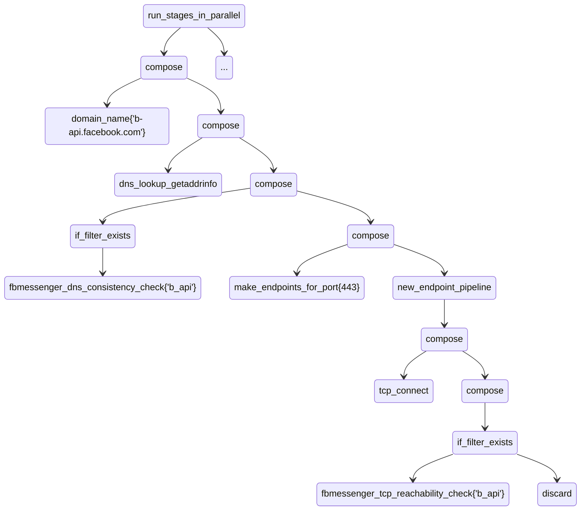

# Richer Input Design PoC

We define "richer input" as the possibility of delivering to OONI-Probe
nettests complex input. As of 2023-05-30, OONI nettests either do not
take any input or take a string as input.

This repository contains a proof-of-concept redesign of OONI probe,
where we implement richer input and explore how it can simplify the
implementation.

## TL;DR

This design introduces an interpreter for a "script" served through
the check-in v2 API. The script contains commands for the
probe, telling it how to change the UI when measuring, what to
measure, and how to save and submit the results.

We define the concept of "mini nettest", which allow nettests such as
the IM ones to measure dynamic targets provided as richer input.

We also define a DSL that allows to compose basic network functionality
together, thus being more flexible than the "mini nettests."

We support these use cases:

1. users can write their own scripts for performing research;

2. we can write our own scripts for testing (e.g., CI);

3. because the backend sends a detailed list of what to do, we can
iterate much faster (e.g., in changing IM tests);

4. in the same vein, we can include custom measurements inside
the experimental card that allow us to conduct research (e.g., we
can measure QUIC blocking in China "right about now");

5. the same data format solves the problem of running tests w/o
a backend or TH, because we can have cached scripts that are
specially tailored to this use case;

6. if the backend computes the top-level keys on submission and
we accept some changes in the data format, several experiments
end up being implemented by the same function: all the IM tests,
tor, and dnscheck would just call code to run mini nettests.

The rest of this document is narrative and introduces the main
concepts in a bottom-up, incremental fashion.

## Key idea: the interpreter

Implementing richer input in OONI Probe is complex because the codebase
has grown organically and mixes several concerns (e.g., fetching
inputs from the OONI backend, running nettests, and updating the locate
measurement database). To explore the design space, we must rethink the
architecture and split it into more fundamental components. We modify
OONI Probe's implementation but do not change the underlying measurement
engine. In particular, we do not modify the interface between the OONI
Probe and the "experiments" (i.e., the underlying implementation of
nettests provided by the measurement engine). This implementation choice
ensures we can integrate the code developed in this PoC more easily into
the main tree.

The legacy implementation of OONI Probe contained a software component
allowing users to run nettests given (a) the probe location and (b)
knowledge of what they wanted to measure. The OONI Probe implementation
included in this PoC provides the same functionality. We obtained this
functionality by taking existing code and factoring away all that was
unnecessary. We will rebuild the rest of the OONI Probe around this
fundamental core.

We call this fundamental core "the interpreter." This name is because we
express "knowledge about what users want to measure" as a JSON document
(with comments and other user-friendly syntactical sugar) that the
"interpreter" interprets. This design
follows the typical split between mechanism and policy often seen in
UNIX tools. The interpreter is the mechanism, and the JSON document,
called the "script," allows users to tell the OONI Probe core what to do.

The interpreter assumes the following. First, the user has already
resolved the IPv4 and IPv6
addresses of the OONI Probe, along with their geolocation information
(country code, ASN, and network name). Second, there is a script telling
the interpreter what to do. How to obtain the script is still up for
debate. The most straightforward approach would be for the check-in API
to serve the script to probes. We can also consider more complex
transformations of the check-in v2 API response.

In this PoC, the `ooniprobe` command exposes the interpreter through a
`runx` ("run experimental") subcommand. Such a subcommand requires the
user to specify the path of two JSON files containing the location and
the script.

## Key idea: enabling user research

Suppose I am a user and want to run HTTP/3 vs. HTTP/2 measurements. In
such a case, I could do that using the design proposed in this PoC
as follows. At first, I would need to write or generate a JSON file
containing location information (usually, OONI Probe itself would
generate this information transparently to the user, but here we are
only discussing the most fundamental functionality). This file would
probably look like this:

```JSONC
// file: location.jsonc
{
    "ipv4": {
        "probe_ip": "88.99.81.188",
        "probe_asn": 24940,
        "probe_cc": "DE",
        "probe_network_name": "Hetzner Online GmbH",
        "resolver_ip": "78.46.173.81",
        "resolver_asn": 24940,
        "resolver_cc": "DE",
        "resolver_network_name": "Hetzner Online GmbH"
    },
    "ipv6": {
        "probe_ip": "2a01:4f8:c012:8aa4::1",
        "probe_asn": 24940,
        "probe_cc": "DE",
        "probe_network_name": "Hetzner Online GmbH",
        "resolver_ip": "2a01:4f8:0:a231::add:2b",
        "resolver_asn": 24940,
        "resolver_cc": "DE",
        "resolver_network_name": "Hetzner Online GmbH"
    }
}
```

Then, I could manually write or generate commands telling the
interpreter what to measure. For example:

```JSONC
// file: simple.jsonc
{
    "commands": [
        {
            "run_command": "nettest/run",
            "with_arguments": {
                "nettest_name": "urlgetter",
                "report_id": "20230406T142431Z_urlgetter_IT_30722_n1_8vFVXzjCjfUFbOA5",
                "targets": [
                    {
                        "annotations": {
                            "check_type": "tls"
                        },
                        "input": "https://8.8.8.8/",
                        "options": {
                            "HTTPHost": "dns.google",
                            "TLSServerName": "dns.google"
                        }
                    },
                    {
                        "annotations": {
                            "check_type": "quic"
                        },
                        "input": "https://8.8.8.8/",
                        "options": {
                            "HTTP3Enabled": true,
                            "HTTPHost": "dns.google",
                            "TLSServerName": "dns.google"
                        }
                    }
                ]
            }
        }
    ],
    "v": 2
}
```

In the PoC, one could run this script as follows:

```console
./ooniprobe runx --location-file location.jsonc --script-file simple.jsonc
```

The script consists of a sequence of commands, and the interpreter
uses the "run_command" key to decide which command to run. The "nettest/run"
command tells the interpreter to run a specific nettest, and the
"with_arguments" key contains command arguments. In the above example, we ask
the interpreter to run "urlgetter" for two targets. For each target,
we use "annotations" to annotate measurements, "input" to identify the
input for urlgetter, and "options" to provide options. The "report\_id"
field contains the report ID for the measurement.

If you are reading this design, you may wonder how I would, as the user
writing the JSON file, obtain the report ID. You would be right. This
topic is covered near the end of this document.

## Key idea: check-in-driven research

Suppose that I, as an OONI Probe developer, want all OONI Probe users
that have given consent to run experimental tests to run some extra tests
meant to understand specific emerging censorship conditions. I can do
that by including nettest-running commands similar to the above in
the check-in v2 response (such that they somehow end up into the script).

To illustrate how to do that, we must first take a detour and introduce
specific commands for driving the output. The script specifies
exactly when OONI Probe should change view and how the progress bar
should increment. Consider this snippet:

```JSONC
// ...
        {
            "run_command": "ui/set_suite",
            "with_arguments": {
                "suite_name": "circumvention"
            }
        },
        {
            "run_command": "ui/set_progress_bar_range",
            "with_arguments": {
                "initial_value": 0,
                "max_value": 0.5
            }
        },
        {
            "run_command": "nettest/run",
            "with_arguments": {
                "nettest_name": "torsf",
                "report_id": "20230406T142431Z_torsf_IT_30722_n1_8vFVXzjCjfUFbOA5"
            }
        },
        {
            "run_command": "ui/set_progress_bar_range",
            "with_arguments": {
                "initial_value": 0.5,
                "max_value": 1
            }
        },
        {
            "run_command": "nettest/run",
            "with_arguments": {
                "nettest_name": "vanilla_tor",
                "report_id": "20230406T142431Z_vanillator_IT_30722_n1_0md7viiR9jvTlXBy"
            }
        },
// ...
```

This snippet tells OONI Probe to draw the card for experimental and how
to increment its progress bar while running nettests. By putting this
information inside the script (instead of inside the code), we make OONI
Probe more flexible.

This section is also the right place to mention that user settings
are orthogonal to the script. When a user runs the above script, they
would only run "vanilla\_tor" and "torsf" if their settings allow such
experiments to run in the current run mode (manual or timed).

Back to our user story, in the hypothetical scenario where I want to add more nettests
to the "experimental" card, I could modify the above JSON document as
follows (or change check-in v2 to serve something that leads to this):

```JSONC
// ...
        {
            "run_command": "ui/set_suite",
            "with_arguments": {
                "suite_name": "circumvention"
            }
        },
        {
            "run_command": "ui/set_progress_bar_range",
            "with_arguments": {
                "initial_value": 0,
                "max_value": 0.33 // <- changed
            }
        },
        {
            "run_command": "nettest/run",
            "with_arguments": {
                "nettest_name": "torsf",
                "report_id": "20230406T142431Z_torsf_IT_30722_n1_8vFVXzjCjfUFbOA5"
            }
        },
        {
            "run_command": "ui/set_progress_bar_range",
            "with_arguments": {
                "initial_value": 0.33, // <- changed
                "max_value": 0.66 // <- changed
            }
        },
        {
            "run_command": "nettest/run",
            "with_arguments": {
                "nettest_name": "vanilla_tor",
                "report_id": "20230406T142431Z_vanillator_IT_30722_n1_0md7viiR9jvTlXBy"
            }
        },
        // ~~~ begin added ~~~
        {
            "run_command": "ui/set_progress_bar_range",
            "with_arguments": {
                "initial_value": 0.66,
                "max_value": 1
            }
        },
        {
            "run_command": "nettest/run",
            "with_arguments": {
                "nettest_name": "urlgetter",
                "report_id": "20230406T142431Z_urlgetter_IT_30722_n1_0md7viiR9jvTlXBy",
                "targets": [ /* ... */ ]
            }
        },
        // ~~~ end added ~~~
// ...
```

Of course, only users who enabled "urlgetter" for the "experimental"
suite would perform these additional measurements.

## Key Idea: mini nettests

**TODO(bassosimone)**: mini nettests are deprecated because the DSL approach
is more flexible. So, we should rewrite the code so that we only use the DSL and
avoid using the "mini nettests". We should probably keep the "mini nettests" in
the design document to document a discarded alternative to the DSL.

We have several nettests that consist of running several smaller nettests
together and computing some test keys. Consider, for example, the IM
nettests or tor. The tor nettest is the most flexible of these nettests
because the API serves its targets.

The key idea of mini nettests is to leverage richer input to provide
input for IM nettests as we do for tor. (We should also rewrite tor to
use mini nettests since this would allow us to reduce code duplication
and consolidate the codebase.)

This PoC rewrites the IM nettests to use mini nettests. A subset of the
telegram nettest, for example, looks like this:

```JSONC
// ...
        {
            "run_command": "nettest/run",
            "with_arguments": {
                "nettest_name": "telegram",
                "report_id": "20230406T142431Z_telegram_IT_30722_n1_lMVwxE4oAaZ00mIM",
                "targets": [
                    {
                        "run_mini_nettest": "http-address",
                        "with_target": {
                            "tags": [
                                "mini_nettest:dc",
                            ],
                            "ip_address": "149.154.175.50",
                            "http_method": "POST",
                            "port": 443
                        }
                    },
                    {
                        "run_mini_nettest": "http-address",
                        "with_target": {
                            "tags": [
                                "mini_nettest:dc",
                            ],
                            "ip_address": "149.154.175.50",
                            "http_method": "POST",
                            "port": 80
                        }
                    },
                    {
                        "run_mini_nettest": "https-domain",
                        "with_target": {
                            "tags": [
                                "mini_nettest:web",
                            ],
                            "domain": "web.telegram.org",
                            "http_header_host": "web.telegram.org",
                            "http_method": "GET",
                            "port": 443,
                            "tls_server_name": "web.telegram.org"
                        }
                    }
                ]
            }
        },
// ...
```

An older version of OONI Probe would ignore the richer input
"targets." Conversely, a richer-input-aware version would implement
telegram as a runner for mini nettests, and each target is a mini
nettest with well-defined semantics. The inner "run_mini_nettest" key identifies a
mini nettest, and the internal "with_target" object provides richer input for
the mini nettest. In the above-example, `http-address` performs
an HTTP transaction with a given TCP endpoint (e.g., `149.154.175.50:80`);
`https-address` combines DNS lookup and accessing the resolved IP
addresses using HTTPS.

Each mini nettest will generate observations with
distinct transaction IDs (as it happens now); thus, ooni/data would
still parse observations.  The "tags" fields end up inside each base data format "tags" field,
allowing the OONI Probe to generate the top-level keys. We could also
use the tags to score the measurement in the fastpath and, in the future,
to generate the top-level keys during the submission.

(The PoC does not use "tags" yet. It uses a scalar field called "id,"
but adding multiple tags supports more algorithms.)

Note that, if we move the top-level keys generation during the submission,
using mini nettests means we can reimplement several nettests by calling
a single, common function that executes a list of mini nettests.

## Key idea: DSL

We have several nettests that consist of running several smaller nettests
together and computing some test keys. Consider, for example, the IM
nettests or tor. The tor nettest is the most flexible of these nettests
because the API serves its targets.

The key idea of the DSL is to leverage richer input to provide
input for IM nettests as we do for tor. (We should also rewrite tor to
use mini nettests since this would allow us to reduce code duplication
and consolidate the codebase.)

This DSL is an extension of [dslx](https://github.com/ooni/probe-cli/blob/master/docs/design/dd-005-dslx.md).

**TODO(bassosimone)**: (1) we should collect cases in which having the DSL
in the past would have allowed us to avoid making emergency releases; (2) we
need to spend more time thinking about robust upgrading as well as keeping
supporting legacy probes with less functionality; (3) think about which
techiques cannot be implemented using the DSL and/or which new experiments
for which we already have an opened issue.

This PoC rewrites the IM nettests to use mini nettests. A subset of the
Facebook Messenger nettest, for example, looks like this:

```JSONC
// This file shows how to define Facebook Messenger in terms of the DSL.
{
  "commands": [
    {
      "run_command": "nettest/run",
      "with_arguments": {
        "experimental_flags": {
          "dsl": true
        },
        "nettest_name": "facebook_messenger",
        "report_id": "20230406T142431Z_facebookmessenger_IT_30722_n1_nLq4AP3YQWmW8hg6",
        "suite_name": "im",

        // the toplevel stage of the DSL tree consists of running several
        // stages in parallel, but here we show just one stage
        "targets": {
          "stage_name": "run_stages_in_parallel",
          "arguments": null,
          "children": [
            {

              // this stage composes two operations A->B and B->C to
              // obtain a new operation A->C
              "stage_name": "compose",
              "arguments": null,
              "children": [
                {
                  // this stage takes in input void and returns a string
                  // representing a domain name to resolve
                  "stage_name": "domain_name",
                  "arguments": {
                    "domain": "b-api.facebook.com"
                  },
                  "children": []
                },
                {
                  "stage_name": "compose",
                  "arguments": null,
                  "children": [
                    {

                      // this stage takes in input a domain name to resolve
                      // and returns in output resolved IP adresses, on
                      // success, or an error on failure
                      "stage_name": "dns_lookup_getaddrinfo",
                      "arguments": null,
                      "children": []
                    },
                    {
                      "stage_name": "compose",
                      "arguments": null,
                      "children": [
                        {

                          // this stage conditionally run its child stage
                          // if its name exists for this probe
                          "stage_name": "if_filter_exists",
                          "arguments": null,
                          "children": [
                            {

                              // this stage checks the DNS lookup results
                              // and sets the related test keys
                              "stage_name": "fbmessenger_dns_consistency_check",
                              "arguments": {
                                "endpoint_name": "b_api"
                              },
                              "children": []
                            }
                          ]
                        },
                        {
                          "stage_name": "compose",
                          "arguments": null,
                          "children": [
                            {

                              // this stage converts the DNS lookup results
                              // into a list of endpoints using port 443
                              "stage_name": "make_endpoints_for_port",
                              "arguments": {
                                "port": 443
                              },
                              "children": []
                            },
                            {
                              // this stage schedules each endpoint belonging
                              // to a list of endpoints to run on a specific
                              // endpoint measurement pipeline provided as its
                              // sub-stage
                              "stage_name": "new_endpoint_pipeline",
                              "arguments": null,
                              "children": [
                                {
                                  "stage_name": "compose",
                                  "arguments": null,
                                  "children": [
                                    {
                                      // this stage performs a TCP connect
                                      "stage_name": "tcp_connect",
                                      "arguments": null,
                                      "children": []
                                    },
                                    {
                                      "stage_name": "compose",
                                      "arguments": null,
                                      "children": [
                                        {
                                          // this stage conditionally sets the test keys
                                          // based on the TCP connect results
                                          "stage_name": "if_filter_exists",
                                          "arguments": null,
                                          "children": [
                                            {
                                              "stage_name": "fbmessenger_tcp_reachability_check",
                                              "arguments": {
                                                "endpoint_name": "b_api"
                                              },
                                              "children": []
                                            }
                                          ]
                                        },
                                        {
                                          // this stage sets the result to void, this
                                          // making the whole pipline void->void
                                          "stage_name": "discard",
                                          "arguments": null,
                                          "children": []
                                        }
                                      ]
                                    }
                                  ]
                                }
                              ]
                            }
                          ]
                        }
                      ]
                    }
                  ]
                }
              ]
            }
            // [snip]
          ]
        }
      }
    }
  ],
  "v": 2
}
```

An older version of OONI Probe would ignore the richer input
"targets." Conversely, a richer-input-aware version would implement
Facebook Messenger as a runner with DSL support. The DSL is a tree
of operations to perform. The JSON above is equivalent to this diagram:



each node in the tree is a stage in a measurement pipeline. Each stage name
indicates the stage semantics, which we briefly described using comments
in the JSONC snippet. The "compose" operation composes together
two stages `s1: A -> B` and `s2: B -> C` to obtain a new stage `s3: A -> C`.

Each stage receives in input a "maybe" monad containing an error or a given
type (so, it would be more proper to write `s1: M A -> M B`). If the input
monad contains an error, the stage would immediately forward the error down
the pipeline with the correct downstream type. Otherwise, the stage will
perform some action that depend on the stage semantics.

Some stages are conditionally defined using `"if_stage_exists"`. We can use this
functionality only for "filter" stages (e.g., `f: M A -> M A)`. We use filter
stages to set the experiment test keys. The implementation of `"if_stage_exists"`
replaces a filter stage with the identity function if it does not know the
name if the stage. This means that we can serve a pipeline that would not break
old probes that do not implement some filters.

Note that, in principle, we can rewrite many nettests (for sure the IM nettests, tor,
dnscheck, stunreachability and possibly others) to use DLS-based richer input.

Compared to the "mini nettests", a DSL based solution is more flexible because we
can express more complex operations using function composition of a finite set
of measurement primitives. This means we need to write (or generate) much less code
inside the probes implementation. Generating code also means that old probes may
not be able to run some operations because they do not implement them.

Additionally, with the DSL and because the stages are monadic, we can implement
writing test keys by implementing the proper filter after each operation. Writing
code to write test keys seems much more complex with "mini nettests".

Also, note how the DSL is not Turing complete and only allows one
to compose network measurement primitives together.

## Minor idea: A/B testing

We include a "feature\_flags" map from string to boolean to each
"nettest/run" command. We will use this map to select experimental
features like we already do. The main difference is that the feature
flags will be nettest-specific, thus providing us with more flexibility
and control over the feature flags.

## Minor idea: invalidating the geolocation

Typically, OONI Probe will invoke the interpreter as a
subroutine and pass it data available on memory rather than JSON files. In
such a case, the location should not be static; rather, it should be an
interface initialized with a known location and capable of invalidating the
location while running nettests.

We propose two algorithms for invalidating the location. The first
algorithm resolves the probe's IPv4 and IPv6, performs geolocation and
sets a boolean flag (checked by the interpreter) when the geolocation
changes. The second algorithm relies on mobile phones features to inform OONI
Probe that we changed the access network (e.g., the phone moved from
Wi-Fi to 3G/4G/5G).

## Minor idea: common code for data analysis

**TODO(bassosimone)**: this minor idea is bound to the "mini nettests"
concept but the DSL does not necessarily require this.

This repository includes a package containing common functions to
simplify data analysis for nettests.

## Minor idea: IPv6 policy

The interpreter will refuse to run a measurement where we have both the
IPv4 and the IPv6 location and they do not match. As dissussed with
[@FedericoCeratto](https://github.com/FedericoCeratto), the cases where
there is a mismatch may indicate (a) Teredo like tunneling or
(b) v4-or-v6-only VPN. We concluded that in these cases it's just
better to avoid runnning measurements.

## Handwaving: the test helper client

Most nettests connect directly to a test helper (TH). Web Connectivity is
an exception; it just needs to exchange messages with the TH. Therefore,
the interpreter also needs to depend on something that looks like an HTTP
client and internally can use several tunnels to deliver messages. This
client is also a requirement for submitting measurements.

## Handwaving: saving and submitting measurements

This PoC and design say that the interpreter's output is an interface
that (a) receives enough information to write an entry into the local
database and (b) uses a complex HTTP client that can use several tunnels
to submit measurements to the OONI backend.

This document does not provide specific details regarding how to save
measurements into the local OONI-Probe database such that they end up
inside the correct "Result" structure. To this end, we could
probably deduce the correct "Result"
from the current card; though, it seems more in line with the spirit of
this design to define commands to tell the probe when to create a new
"Result." We will investigate this topic as part of our future work.

## Handwaving: check-in v2 API

This document mentions that, under normal operating circumstances,
the OONI Probe somehow computes the script using data provided by the
check-in v2 API. It also says that the idempotent transformation is the
most straightforward (i.e., the check-in v2 API response is a script). We
will define the check-in v2 response as part of our future work.

**TODO(bassosimone)**: we discussed this topic with Federico and we
concluded it would be better to avoid doing mangling in the probe. The
check-in v2 API would therefore serve us a script directly (or maybe
two script: an interactive one and a backend-less one).

## Handwaving: report ID for research

When writing a script file manually, the user does not know the
report ID. We currently have a component in OONI Probe that automatically
sets the report ID when submitting, by opening a report every time this
is needed. We could use this component. Or, we could choose to instead
generate a random report ID inside the probe. If we follow the latter
path, though, we must include a "session ID" as an annotation, since this
is useful to ooni/data analysis. Adding a "session ID" seems a useful
idea anyway.

**TODO(bassosimone)**: We discussed the session ID concept with Federico
and we concluded that we need more inter-team discussion. A session
could run for longer time than a single measurement session, but that
may leak the users' behavior. Additionally, it may be that the probe ID
already provides a useful signal there. However, it seems that the probe
ID is not being ready for around one year, so an interim solution
could be a nonce generated by the probe as an annotation and called run ID.

## Handwaving: running telegram with no backend support

OONI Probe derives the script from the check-in v2 response applying
some transformation. The script, in turn, defines telegram and
other IM nettests by specifying what mini nettests they should run. If
there is a partial internet shutdown, a user that cannot communicate
with the OONI backend cannot obtain the correct mini nettests for
telegram. Therefore, they cannot run the telegram experiment. We will
address this issue as part of our future work. A possible solution
to this issue consists of caching specific information, and refreshing
the cache each time the check-in v2 completes successfully.

**TODO(bassosimone)**: the check-in v2 API could serve us two
scripts. A short term one, useful for the current run, and a long
term one useful to allow users to perform measurements during a
partial internet shutdown. The latter script should not depend on
the backend (i.e., urlgetter instead of web connectivity). The probe
should also ship with a fallback last-resort script.

## Forward compatibility: commands and nettests

As discussed with [@FedericoCeratto](https://github.com/FedericoCeratto), we
will use the `v` field inside the script for versioning.

## Forward compatibility: breaking changes

As discussed with [@FedericoCeratto](https://github.com/FedericoCeratto), we
will use the `v` field inside the script for versioning.

## Forward compatibility: OONI Run v2

The check-in v2 API will serve additional nettests to run that measure
targets defined using OONI Run v2. As mentioned, we are still determining
whether the check-in v2 API will serve a script structure directly. In
any case, eventually, OONI Run v2 information will translate into
commands related to (a) drawing the UI; (b) running nettests; and
(c) saving measurements.

## Future directions: richer-input streaming

We can imagine specific richer input allowing us to instruct a nettest to
communicate with an interactive backend, where the backend serves a mini
nettest to the probe, reads the results and then serves follow-up actions
for the probe that depend on (a) what the backend knows in general and
(b) results returned by that specific probe. This design seems out of scope
for an initial implementation of richer input, but could become a useful
tool to address specific research questions at a later time.
